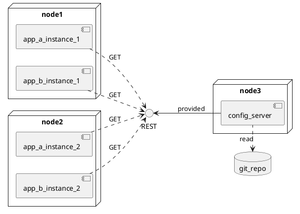
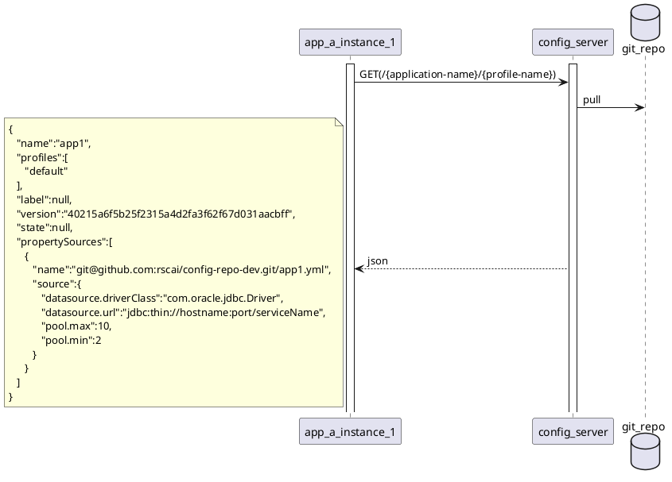
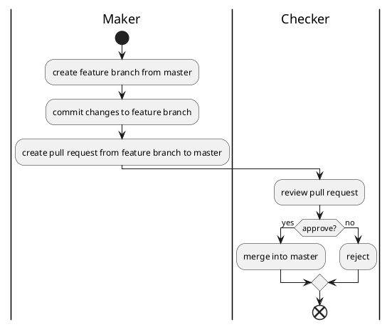
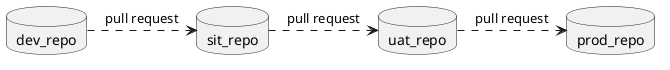

# Spring Cloud Config Server Demo

## Summary

* Centralizing configuration
* Decoupling changes/deployment of code and configuration
* Control and audit configuration changes
* Configuration as Code

## Deployment

Configuration is wrote in property and yaml files, and stored in Git repository. Config server is reading content of Git repository, and expose content as read only REST API. Application read specific configuration by request corresponding URL to config server.

## REST API

Expose two types of resources:

1. Profile
2. File

**Profile**

HTTP Method|URI Pattern                        |Response MIME
-----------|-----------------------------------|-------------
GET        |/{application-name}/{profile-name} |application/json

**File**

HTTP Method|URI Pattern                        |Response MIME
-----------|-----------------------------------|-------------
GET        |/{application-name}-{profile-name}.{suffix} |text/plain

## Application Read Configuration

## Change Configuration

Config server is only reading master branch. 
Maker must not commit configuration changes to master branch directly. Instead, Maker should create a feature branch from master branch, then commit configuration changes to the feature branch.
After all configuration changes is ready on feature branch, then maker create a pull request from feature branch to master branch.
Checker review the pull request and decide if accept these changes.

## Promote Configuration Changes

All code changes must go through mature verification process. Same for configuration changes.

Maker create pull request from lower environment configuration repository (master branch) to higher environment configuration repository (master branch).
Checker review pull request and decide if accept changes.